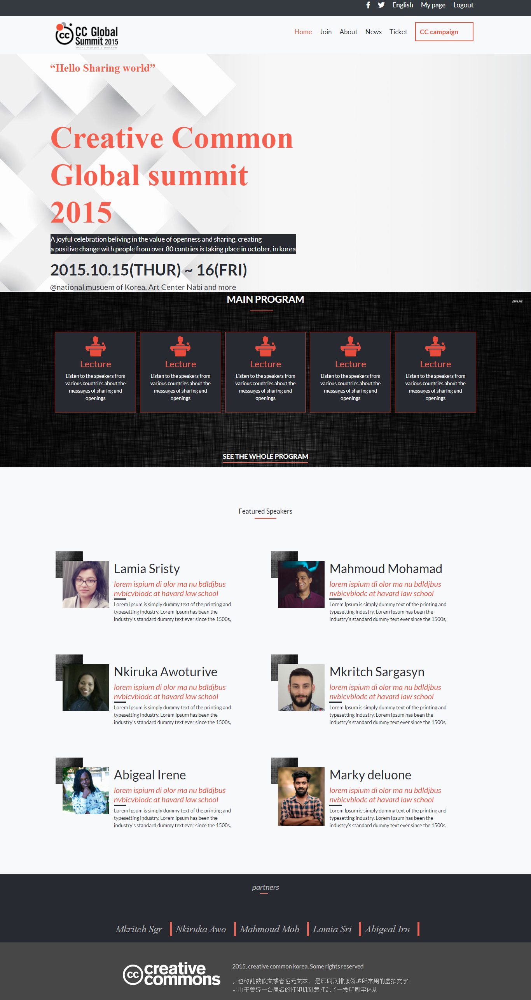
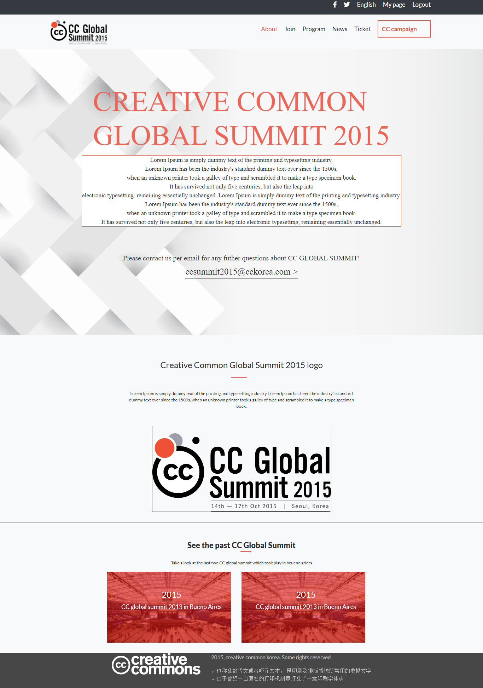
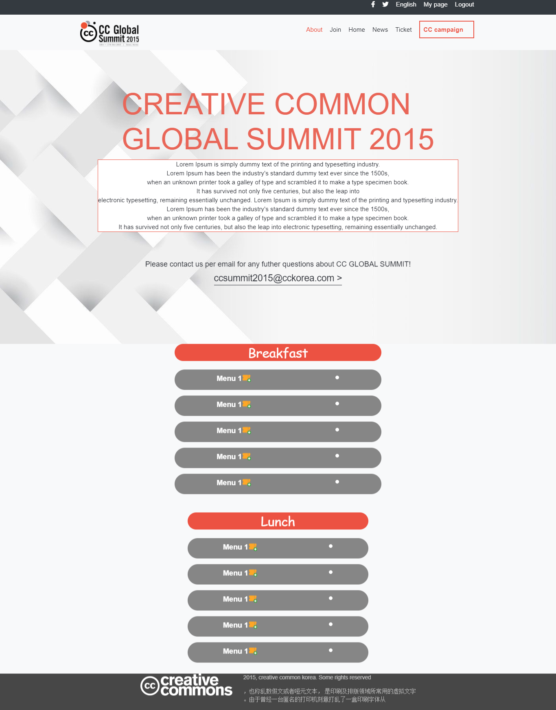

# cc global summit

> Clone of CC global summit, a conference held in korea in 2015.

![screenshot] 
![screenshot] 
![screenshot] 

> This project is based on an online conference in korea. Design is followed from this website https://www.behance.net/gallery/29845175/CC-Global-Summit-2015 , I changed somethings about the webpage especially in the ticket page.

## Built With

- HTML
- CSS3
- Font awesome icons
-icon8 icons
- Bootstrap 4

## Watch a video presentation of the project 

[watch loom video](https://www.loom.com/share/0585d0edd9d44188a43e2b36aec4fc7f).

## Live Demo

[Live Demo Link for full page.html](https://rawcdn.githack.com/AkintoyeOlamide/ccglobal-summit/3ec09d858f042d3c273a7a440ea470cb5a082d72/index.html)

## To get a local copy up and running follow these simple example steps.

### Setup

Clone the project locally

### Linters

1. run `npm install`.
2. run `npm run test` to check the Html and CSS files

## Author

👤 **Akintoye Olamide**

- Github: [@githubhandle](https://github.com/AkintoyeOlamide)
- Twitter: [@twitterhandle](https://twitter.com/@toshactL)
- Linkedin: [linkedin](https://www.linkedin.com/in/akintoye-olamide-baa80b1a4/)
- Email:  akintoyeolamide500@gmail.com

## Show your support

Give a ⭐️ if you like this project!

## 📝 License

This project is [MIT](lic.url) licensed.
